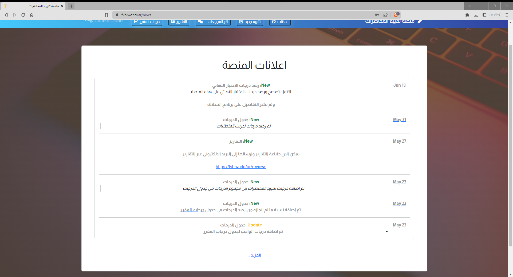

# منصة تقييم المحاضرات
تم اكتمال تنفيذ مشروع المنصة بنجاح، ونظرا لعدم الحاجة له في الوقت الحالي، تم الايقاف الموقت للنظام، وهنا بعض الصور التي توضح النظام بشكل مرئي. على أن يتم دراسة اطلاق النظام مرة أخرى لمقرر آخر أو كمنصة عامة للتقييمات.

## الصفحة الرئيسية

## تسجيل الدخول

  
عرض

  
   
  

## واجهة النظام

  
عرض

  

## نموذج التقييم

  
عرض

  
  

## آخر المراجعات

  
عرض

  
  
  
  
  

## التقارير

  
عرض

  
  

## درجات المقرر

  
عرض

  

## اعلانات المنصة

  
عرض

  

## معلومات الحساب

  
عرض

  

## تسجيل الخروج

  
عرض

  

# دعم اللغة الانجليزية 

  
عرض

  

# دعم شاشات عرض مختلفة

  
عرض

  
  

